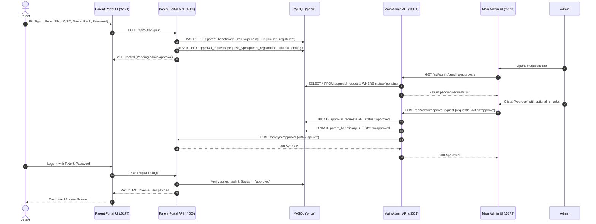

# Special Children Management System (SCMS) — LLM & Developer Guide

> **Audience**: AI Agents (Claude, Gemini, GPT) and Human Developers working on this codebase.  
> **Purpose**: Serve as the single source of truth for the architecture, data flows, database schemas, API contracts, cross-system sync bridges, and operational nuances of SCMS.

---

## 1. Executive Summary & Domain Context

**SCMS** is an institutional welfare and medical management platform custom-built for the **Pakistan Navy Benevolent Association (PNBA)**.

Its core mission is to track and support naval personnel (serving, retired, or expired) who have dependent children with physical, cognitive, or medical disabilities.

### Core Capabilities
1. **Beneficiary Registry**: Comprehensive naval parent identity tracking (`P_No_O_No`, rank, unit, service status, almirah & physical file tracking, banking details).
2. **Special Children Medical Profiles**: Detailed child disability tracking, schooling records, and official classification into **Disability Categories** (`A` = Severe, `B` = Moderate, `C` = Mild).
3. **Four-Document Medical Verification**: Strict document audit trail (Doctor Assessment Performa, Application Form, NCRDP/PCRDP Disability Certificate, and B-Form/CNIC).
4. **Financial Grants & Assistive Gadgets**: Monthly grant allocations, Current Financial Year (CFY) computation, and assistive gadget procurement with automated 18% tax calculations.
5. **Decentralized Regional Authorities**: Scoped access for naval command headquarters (HQ COMNOR, HQ COMKAR, HQ COMLOG, HQ COMPAK, etc.).
6. **Self-Service Parent Portal**: Enables naval parents to register accounts, register special children, upload medical performas, and manage banking information directly.

---

## 2. System Architecture & Topology

The repository contains **two complete full-stack web applications** backed by a **single shared MySQL database (`pnba`)**:

```text
┌──────────────────────────────────────────────────────────────────────────────┐
│                        MAIN SCMS (Root Directory)                            │
│                                                                              │
│   Frontend (Vite + React 19 + TypeScript + Tailwind) - PORT 5173             │
│     ├── Main Admin Portal    --> http://localhost:5173/                      │
│     └── Authority Portal     --> http://localhost:5173/authority.html        │
│                                                                              │
│   Backend API (Node.js + Express 5 + MySQL2 Pool) - PORT 3001                │
│     ├── REST Endpoints       --> /api/parents, /api/children, /api/grants... │
│     └── Admin Approvals      --> /api/admin/pending-approvals, approve...    │
└──────────────────────────────────────┬───────────────────────────────────────┘
                                       │
                      Inter-Service Sync Bridge
                      (X-API-KEY / PORTAL_API_KEY)
                      • /api/sync/approval
                      • /api/sync/admin-created-parent
                      • /api/admin/document-view (Proxy)
                                       │
┌──────────────────────────────────────▼───────────────────────────────────────┐
│                     PARENT PORTAL (parent-portal/)                           │
│                                                                              │
│   Frontend (Vite + React + JavaScript + Tailwind) - PORT 5174                │
│     └── Parent Self-Service  --> http://localhost:5174/ (Vite proxy /api)    │
│                                                                              │
│   Backend API (Node.js + Express 4 + JWT + Multer) - PORT 4000               │
│     ├── Auth & Profile       --> /api/auth/login, signup, /api/profile       │
│     ├── Child & Docs Upload  --> /api/children, /api/children/:id/documents  │
│     └── Banking Management   --> /api/parent/banking                         │
└──────────────────────────────────────┬───────────────────────────────────────┘
                                       │
                                       ▼
┌──────────────────────────────────────────────────────────────────────────────┐
│                        SHARED DATABASE: MySQL 'pnba'                         │
│                    Default Host: 127.0.0.1:3306                              │
│   Tables: Parent_Beneficiary, Dependent_Children, Banking_Details,           │
│           Document_Tracking, Monthly_Grants, Child_Gadgets,                  │
│           Parent_Document_Files, Approval_Requests, Authority_Passwords      │
└──────────────────────────────────────────────────────────────────────────────┘
```

### Network Topology & Port Map

| Component | URL | Port | Technologies | Purpose |
| :--- | :--- | :--- | :--- | :--- |
| **Main Admin UI** | `http://localhost:5173` | 5173 | Vite, React 19, TS, Tailwind, Radix | Admin, Finance, Operator dashboard |
| **Authority UI** | `http://localhost:5173/authority.html` | 5173 | Multi-page Vite entry, React, CSS | Command-scoped regional dashboard |
| **Main Backend** | `http://localhost:3001` | 3001 | Node.js, Express, MySQL2 Pool | Central business logic & DB gateway |
| **Parent Portal UI** | `http://localhost:5174` | 5174 | Vite, React, JS, Tailwind | Parent self-service application |
| **Parent Portal API** | `http://localhost:4000` | 4000 | Node.js, Express, JWT, Multer | Parent auth, uploads, sync bridge |
| **MySQL Server** | `127.0.0.1:3306` | 3306 | MySQL Server 8.0+ / 9.x | Shared datastore (`pnba`) |

---

## 3. Database Schema Reference (`pnba`)

Both backends connect to the **same database (`pnba`)**.

> [!IMPORTANT]
> **Primary Key Convention**: The primary key for parents is **`P_No_O_No`** (Navy Personal / Official Number as `VARCHAR(50)`), **NOT** an auto-increment integer. Always query parents by `P_No_O_No`.

### Table Breakdown

#### 1. `parent_beneficiary` (Core Parent Identity)
| Column | Type | Nullable | Description / Notes |
| :--- | :--- | :--- | :--- |
| `P_No_O_No` | `VARCHAR(50)` | NO (PK) | Navy Personal/Official No (e.g. `101`, `PN-12345`) |
| `Parent_Name` | `VARCHAR(100)` | NO | Full name of the naval parent |
| `Rank_Rate` | `VARCHAR(50)` | YES | Navy rank (e.g. Commander, Captain, Sailor) |
| `Unit` | `VARCHAR(100)` | YES | Navy unit / ship (e.g. PNS Test, HQ COMNOR) |
| `Admin_Authority` | `VARCHAR(100)` | YES | Controlling command (e.g. HQ COMNOR, HQ COMKAR) |
| `Service_Status` | `ENUM` | YES | `'Serving'`, `'Retired'`, `'Expired'` |
| `Parent_CNIC` | `VARCHAR(20)` | YES | National CNIC (`xxxxx-xxxxxxx-x`) |
| `Contact_No` | `VARCHAR(50)` | YES | Primary phone number |
| `Email` | `VARCHAR(100)` | YES | Email address |
| `Address` | `VARCHAR(255)` | YES | Residential address |
| `No_of_Disabled_Children` | `INT` | YES | Default 0, computed count of special children |
| `Password_Hash` | `VARCHAR(255)` | YES | Bcrypt hash for parent portal login |
| `Status` | `ENUM` | YES | `'pending'`, `'approved'`, `'rejected'` (default `'pending'`) |
| `Origin` | `ENUM` | YES | `'self_registered'`, `'admin_created'` |
| `Default_Password_Changed`| `BOOLEAN` | YES | Forced password reset flag on first login |
| `Created_At` | `TIMESTAMP` | YES | Registration timestamp |
| `Approved_At` | `TIMESTAMP` | YES | Admin approval timestamp |

#### 2. `dependent_children` (Special Children Records)
| Column | Type | Nullable | Description / Notes |
| :--- | :--- | :--- | :--- |
| `Child_ID` | `INT` | NO (PK, AI)| Unique child identifier |
| `P_No_O_No` | `VARCHAR(50)` | YES (FK) | Reference to `parent_beneficiary(P_No_O_No)` |
| `Child_Name` | `VARCHAR(100)` | NO | Child full name |
| `Age` | `DECIMAL(4,1)` | YES | Age in years (supports decimals e.g. 5.5) |
| `CNIC_BForm_No` | `VARCHAR(20)` | YES (UNIQUE)| Child B-Form or CNIC |
| `Disease_Disability` | `TEXT` | YES | Medical diagnosis / disability description |
| `Disability_Category` | `CHAR(1)` | YES | `'A'` (Severe), `'B'` (Moderate), `'C'` (Mild) |
| `Disability_Certificate_No`| `VARCHAR(100)` | YES | NCRDP/PCRDP certificate reference number |
| `Authority` | `VARCHAR(100)` | YES | Issuing authority |
| `Category_Allotted_By` | `VARCHAR(100)` | YES | Doctor/Board allotting the category |
| `School` | `VARCHAR(100)` | YES | School name (or Special Education Centre) |
| `Status` | `ENUM` | YES | `'pending'`, `'approved'`, `'rejected'` |
| `Created_At` | `TIMESTAMP` | YES | Record creation timestamp |

#### 3. `banking_details` (Disbursal Banking Info)
| Column | Type | Nullable | Description / Notes |
| :--- | :--- | :--- | :--- |
| `Account_ID` | `INT` | NO (PK, AI)| Unique banking record ID |
| `P_No_O_No` | `VARCHAR(50)` | YES (FK) | Reference to `parent_beneficiary` |
| `Bank_Name` | `VARCHAR(100)` | YES | Bank name (e.g. HBL, Askari Bank) |
| `Account_Title` | `VARCHAR(100)` | YES | Account holder name |
| `Account_Number`| `VARCHAR(50)` | YES | Standard bank account number |
| `Branch_Code` | `VARCHAR(20)` | YES | Bank branch code |
| `Branch_Address`| `VARCHAR(255)` | YES | Physical branch location |
| `IBAN` | `VARCHAR(50)` | YES (UNIQUE)| 24-character International Bank Account Number |
| `Routing_Number`| `VARCHAR(20)` | YES | Routing / clearing code |
| `CNIC_of_Account_Holder` | `VARCHAR(20)` | YES | CNIC linked to bank account |

#### 4. `monthly_grants` (Financial Disbursals)
| Column | Type | Nullable | Description / Notes |
| :--- | :--- | :--- | :--- |
| `Grant_ID` | `INT` | NO (PK, AI)| Unique grant ID |
| `Child_ID` | `INT` | YES (FK) | Reference to `dependent_children(Child_ID)` |
| `Monthly_Amount` | `DECIMAL(10,2)`| YES | Monthly stipend amount (PKR) |
| `Total_CFY_Amount` | `DECIMAL(10,2)`| YES | Current Financial Year cumulative total |
| `Approved_From` | `DATE` | YES | Start date of grant approval |
| `Approved_To` | `DATE` | YES | Expiry date of grant approval |

#### 5. `child_gadgets` (Assistive Technology Procurement)
| Column | Type | Nullable | Description / Notes |
| :--- | :--- | :--- | :--- |
| `Gadget_ID` | `INT` | NO (PK, AI)| Unique gadget record ID |
| `Child_ID` | `INT` | YES (FK) | Reference to `dependent_children(Child_ID)` |
| `Detail_of_Gadgets` | `VARCHAR(255)` | YES | Item name (e.g. Wheelchair, Hearing Aid, Orthotics) |
| `Base_Cost` | `DECIMAL(10,2)`| YES | Pre-tax base cost in PKR |
| `Tax_18_Percent` | `DECIMAL(10,2)`| VIRTUAL | Stored generated column: `Base_Cost * 0.18` |
| `Total_Cost` | `DECIMAL(10,2)`| VIRTUAL | Stored generated column: `Base_Cost * 1.18` |
| `Acquisition_Type` | `ENUM` | YES | `'Off the Shelf'`, `'Customized'`, `'Reimbursed'` |

#### 6. `approval_requests` (Approval Inbox Queue)
| Column | Type | Nullable | Description / Notes |
| :--- | :--- | :--- | :--- |
| `request_id` | `INT` | NO (PK, AI)| Unique request ID |
| `user_id` | `VARCHAR(50)` | NO | Parent `P_No_O_No` |
| `request_type` | `VARCHAR(50)` | NO | `'parent_registration'` or `'child_addition'` |
| `payload` | `JSON` / `TEXT`| NO | Serialized JSON containing all submission data |
| `status` | `ENUM` | NO | `'pending'`, `'approved'`, `'rejected'` |
| `admin_notes` | `TEXT` | YES | Reason/remarks written by admin |
| `created_at` | `TIMESTAMP` | YES | Submission timestamp |
| `reviewed_at` | `TIMESTAMP` | YES | Admin review timestamp |

#### 7. `parent_document_files` (Medical Verification Files)
Stores metadata for documents uploaded via parent portal:
- `P_No_O_No`: Naval ID
- `Doc_Type`: `'assessment_performa'`, `'application_form'`, `'disability_certificate'`, or `'identity_proof'`
- `Original_File_Name`: Original file name
- `Stored_File_Name`: Unique disk file name
- `Storage_Path`: Full path on disk (e.g. `scmsForms/{PN}/{type}_{cnic}.jpg`)

#### 8. `authority_passwords` (Regional Command Logins)
- `authority`: Regional command identifier (e.g. `HQ COMNOR`, `HQ COMKAR`, `HQ COMLOG`, `HQ COMPAK`, `HQ COMCOAST`, `HQ FOST`, `HQ NSFC`, `HQ PMSA`)
- `password`: Password (default `12345678`)

---

## 4. Codebase Directory Map

```text
scms/
├── package.json                   # Root dependencies (React 19, Vite, Express 5, Tailwind, Radix)
├── vite.config.ts                 # Vite config (multi-page inputs: index.html & authority.html, proxy /api -> :3001)
├── index.html                     # Main Admin portal entry HTML
├── authority.html                 # Authority portal entry HTML
├── scripts/
│   └── dev.mjs                    # Concurrent runner (spawns node server/index.js + vite dev:client)
├── server/
│   ├── database.js                # MySQL2 pool configuration, query helper, schema migrations
│   ├── index.js                   # Main Admin Express API (Port 3001), routes, sync bridge
│   └── uploads/                   # Uploaded documents for main admin
├── src/
│   ├── main.tsx                   # Main Admin app root
│   ├── App.tsx                    # Main Admin shell (sidebar, navigation, page routing)
│   ├── authority-main.tsx         # Authority app entry root
│   ├── AuthorityApp.tsx           # Authority app shell (login, scoped dashboard, theme)
│   ├── components/
│   │   ├── Admin/
│   │   │   ├── RequestsTab.jsx    # Approvals Inbox: Parent registrations & Child additions
│   │   │   └── AuthorityManagement.jsx # Password manager for regional command authorities
│   │   ├── Auth/
│   │   │   └── AuthorityLogin.jsx # Command selection & password login
│   │   ├── Authority/             # Regional authority dashboard & analytics
│   │   └── ImagePopup.jsx         # Full-screen modal for reviewing uploaded medical docs
│   ├── sections/
│   │   ├── Dashboard.tsx          # Main KPI dashboard (beneficiaries, categories, grants)
│   │   ├── ParentManagement.tsx   # Parent table, search, filters, and detail drawer
│   │   ├── ParentForm.tsx         # Parent creation/edit form (with direct portal sync)
│   │   ├── ChildForm.tsx          # Child creation/edit form
│   │   ├── ChildDetail.tsx        # Child medical profile detail view
│   │   ├── GrantGadgetManager.tsx # Grants & Gadgets calculator, disbursals, tax
│   │   ├── ReportsExports.tsx     # PDF / Excel export generators
│   │   └── Login.tsx              # Admin role-based login (Admin, Finance, Operator, Viewer)
│   ├── services/
│   │   ├── database.ts            # Client-side data store, API sync layer, mock/fallback
│   │   └── auth.ts                # Client-side role and permission management
│   └── types/
│       └── index.ts               # Core TypeScript interface definitions
│
└── parent-portal/
    ├── package.json               # Parent portal backend dependencies (Express, Bcrypt, JWT, Multer)
    ├── server.js                  # Parent portal API server (Port 4000), auth, uploads, sync bridge
    ├── .env                       # Parent portal environment config
    └── client/
        ├── package.json           # Parent portal client dependencies (Vite, React, Tailwind)
        ├── vite.config.js         # Vite config (Port 5174, proxy /api -> :4000)
        └── src/
            ├── App.jsx            # Router (/login, /signup, /dashboard/*)
            ├── context/
                ├── AuthContext.jsx  # JWT state management (key: 'portalToken')
                └── ThemeContext.jsx # Dark / Light mode context
            └── components/
                ├── Auth/
                │   ├── UnifiedLogin.jsx # Login page (PN Number + Password)
                │   └── SignupForm.jsx   # Registration form (Submits for admin approval)
                └── Dashboard/
                    ├── Dashboard.jsx    # Sidebar and dashboard routing
                    ├── Profile.jsx      # Parent profile view
                    ├── AccountManagement.jsx # Password change & contact info edit
                    ├── ChildrenList.jsx # List of registered children & approval status
                    ├── AddChildForm.jsx # 2-Step child addition & 4-doc upload wizard
                    └── Banking.jsx      # Bank details create/read/update/delete
```

---

## 5. End-to-End Workflows & Data Lifecycles

### Workflow 1: Parent Self-Registration & Approval


---

### Workflow 2: Child Registration & 4-Document Upload Wizard
1. **Step 1 (Child Info)**:
   - Parent inputs child name, age, CNIC/B-Form, disability description, disability category (A/B/C), and school.
   - PUI calls `GET /api/children/check-cnic?cnic=...` to ensure no duplicates.
   - PUI calls `POST /api/children` on `:4000`.
   - Creates child record in `dependent_children` with `Status = 'pending'`.
2. **Step 2 (Document Upload)**:
   - Parent must upload **4 mandatory verification files**:
     1. `assessment_performa`: Medical disability assessment by Specialist Doctor.
     2. `application_form`: Signed application form + service card + authorization.
     3. `disability_certificate`: NCRDP / PCRDP disability certificate.
     4. `identity_proof`: Child B-Form or CNIC image.
   - Files are POSTed to `POST /api/children/:childId/documents` via Multer.
   - Files are stored on disk at: `scmsForms/{P_No_O_No}/{docType}_{cnic}.{ext}`.
   - Metadata is recorded in `parent_document_files`.
   - An approval request is recorded in `approval_requests` (`request_type = 'child_addition'`).
3. **Admin Verification & Image Preview**:
   - Admin in Main Admin UI (`RequestsTab.jsx`) views the child addition request.
   - Admin clicks "View Documents" -> calls `GET /api/admin/child-documents?childId=...`.
   - Admin clicks any document -> `ImagePopup.jsx` requests `GET /api/admin/document-view?path=...`.
   - Main backend proxies the image stream directly from the Parent Portal document filesystem.
   - Admin approves child -> Main backend sets child `Status = 'approved'`.

---

### Workflow 3: Admin Creating Parent Directly
1. Admin opens **Beneficiaries** -> **Add New Parent** in Main Admin UI.
2. Main backend receives `POST /api/admin/parents-with-portal`.
3. Inserts parent into `parent_beneficiary` with `Origin = 'admin_created'`.
4. Main backend calls `POST /api/sync/admin-created-parent` on Parent Portal API (`:4000`) with header `x-api-key: PORTAL_API_KEY`.
5. Portal generates default credentials:
   - Username: `P_No_O_No`
   - Default Password: `12345@<P_No_O_No>` (or `password@<P_No_O_No>`)
   - Sets `Default_Password_Changed = false`.
6. On first login, parent is forced to change their default password.

---

### Workflow 4: Regional Authority Portal Scoped Access
1. Regional officer opens `http://localhost:5173/authority.html`.
2. Selects their command authority (e.g. `HQ COMNOR`, `HQ COMKAR`).
3. Enters authority password (verified against `authority_passwords` table).
4. System issues an authority-scoped JWT.
5. All queries on the Authority Dashboard strictly filter records where `Admin_Authority = <Selected Authority>`.

---

## 6. Authentication & Security Architecture

### Main Admin Authentication (`src/services/auth.ts`)
- **Roles**:
  - `Admin`: Full read/write/delete access across all modules, approvals, and authority settings.
  - `Finance Officer`: Restricted to **Grants & Gadgets** and **Reports**.
  - `Data Entry Operator`: Read/write access to parents, children, and documents; no deletion or approvals.
  - `Viewer`: Read-only access across parents, children, and reports.
- **Default Test Logins**:
  - `admin` / `admin123`
  - `finance` / `finance123`
  - `operator` / `operator123`
  - `viewer` / `viewer123`

### Parent Portal Authentication (`parent-portal/server.js`)
- **Login Identifier**: `P_No_O_No` (string, case-preserved or upper-cased).
- **Password**: Hashed using `bcrypt` (12 rounds).
- **Token**: Standard JWT signed with `PORTAL_JWT_SECRET`, expiring in 24 hours.
- **Token Key in Storage**: **`portalToken`** in `localStorage` (along with `portalUser`).
  > [!WARNING]
  > Never read `localStorage.getItem('token')` in parent portal components! Always use `const { token } = useAuth()` or `localStorage.getItem('portalToken')`.

### Inter-Service Bridge Authentication
- Communication between Main Backend (`:3001`) and Parent Portal Backend (`:4000`) uses an API key header:
  ```http
  x-api-key: scms_sync_secret_2024_change_this
  ```
- Configured via `PORTAL_API_KEY` in root `.env` and `ADMIN_API_KEY` in `parent-portal/.env`.

---

## 7. Critical Gotchas, Quirks & Bug History

Any LLM modifying this project MUST be aware of these historical failure modes:

| Issue | Details / Solution |
| :--- | :--- |
| **Column name: `Parent_CNIC` vs `CNIC`** | In `parent_beneficiary`, the database column is **`Parent_CNIC`**. Querying `SELECT CNIC` returns NULL without throwing an error in MySQL aliases. Always use `Parent_CNIC`. |
| **Token storage key: `portalToken`** | The parent portal `AuthContext.jsx` saves tokens under `localStorage.setItem('portalToken', ...)`. Components that called `localStorage.getItem('token')` received `null` and threw 401s. Always use `useAuth()`. |
| **Primary Key is String `P_No_O_No`** | Do not write SQL queries assuming `id` or integer auto-increment on parents. Queries must use `WHERE P_No_O_No = ?`. |
| **Multer Upload Path** | Uploads are stored at `UPLOAD_DIR/{P_No_O_No}/{docType}_{identifier}.ext`. Default fallback directory is `scmsForms/` in the parent directory. |
| **Duplicate Route Precedence in Express** | Express processes routes sequentially. If duplicate route definitions exist (e.g. two `app.get('/api/profile')`), only the first will ever execute. All duplicate handlers must be merged. |
| **`dependent_children` `Created_At` Column** | Queries ordering by `Created_At` require this column to exist in the database. Ensure schema migration has run `ALTER TABLE dependent_children ADD COLUMN Created_At TIMESTAMP DEFAULT CURRENT_TIMESTAMP`. |

---

## 8. How to Run, Test, and Verify

### Running the Services

The system requires 3 terminal processes:

#### Terminal 1: Main Admin Portal + Main API (Port 5173 + 3001)
```powershell
cd c:\Users\hayya\VSCode\Surf\scms
npm run dev
```
- Starts Express API on `http://localhost:3001`
- Starts Vite Admin Frontend on `http://localhost:5173`
- Authority Portal available at `http://localhost:5173/authority.html`

#### Terminal 2: Parent Portal API (Port 4000)
```powershell
cd c:\Users\hayya\VSCode\Surf\scms\parent-portal
npm start
```
- Starts Express Parent API on `http://127.0.0.1:4000`

#### Terminal 3: Parent Portal Frontend (Port 5174)
```powershell
cd c:\Users\hayya\VSCode\Surf\scms\parent-portal\client
npm run dev
```
- Starts Vite Parent Frontend on `http://127.0.0.1:5174`

### Checking Port Health in PowerShell
```powershell
Get-NetTCPConnection -State Listen | Where-Object { $_.LocalPort -in 3001, 4000, 5173, 5174 } | Select-Object LocalAddress, LocalPort, OwningProcess
```

### Running Automated API Health Check
```powershell
curl http://localhost:3001/api/health
curl http://127.0.0.1:4000/health
```

---

## 9. Quick Cheat Sheet for LLMs

When prompted to make changes to SCMS, follow these guidelines:
1. **Adding a new field to parents**: Update both `Parent_Beneficiary` schema in `server/database.js`, the SELECT queries in `server/index.js` and `parent-portal/server.js`, and the frontend types in `src/types/index.ts`.
2. **Adding an approval step**: Insert into `approval_requests`, display in `src/components/Admin/RequestsTab.jsx`, and handle action in `POST /api/admin/approve-request`.
3. **Editing Parent Portal Client**: Always import `useAuth` from `../../context/AuthContext` to get the current JWT `token` and authenticated `user`.
4. **Database transactions**: Use `await transaction(async (conn) => { ... })` from `server/database.js` whenever performing multi-table modifications.
