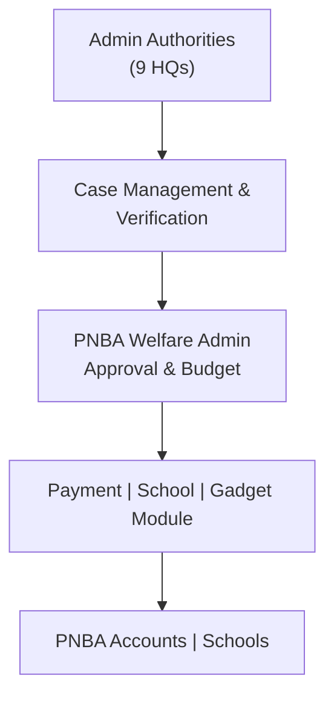
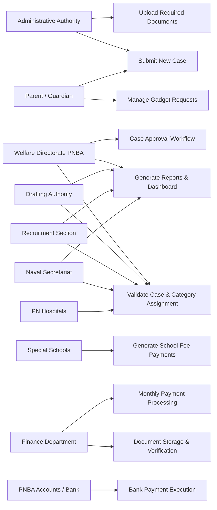
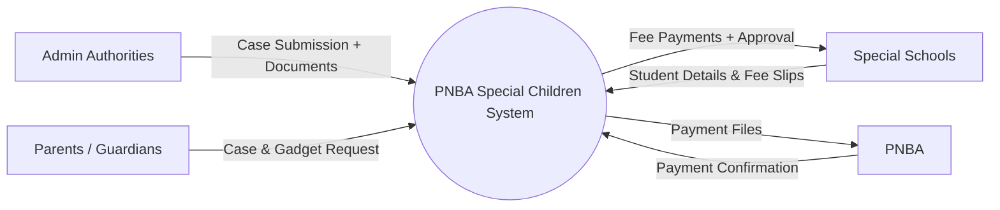

# SCWMS PNBA — Special Children Welfare Management System

> Converted from the image-based PDF (pages 1–18). Diagrams are recreated as Mermaid/text from the OCR content.

## Page 1 — Contents / Project Section Index

1. Project Overview
2. Annual Budget Allocation
3. Admin Authorities (Case Origin)
4. Special Children Categories & Payment Structure
5. Required Documents for Case Approval
6. PNBA Supported Special School
7. Special Gadget / Equipment Provision
8. User Role & Permissions
9. System Work Flow (High Level)
10. Project Description
11. Project Justification
12. Project Purpose
13. Procedure / Workflow Details
14. Product Scope
15. Product Perspective

---

## Page 2 — Project Overview, Annual Budget, Admin Authorities

### 1. Project Overview

Special Children System (SCS) is a centralized digital platform developed for PNBA to manage Special Children Welfare Program.

**Purpose:**

- Record & verify special children's cases from multiple Pakistan Navy formations
- Process monthly welfare payments
- Manage school fee support & grants
- Manage special gadgets allotment
- Ensure transparency of allocated 40 Million Annual Budget

### 2. Annual Budget Allocation

| Item | Budget Source | Amount |
|---|---|---|
| Special Children Program | PNBA Welfare Fund | 40M |

### 3. Admin Authorities (Case Origin)

SCS will receive cases from following Nine Admin Authorities:

1. HQ COMNOR
2. HQ COMKAR
3. HQ COMCEP
4. HQ COMCOAST
5. HQ COMPAK
6. HQ FOST
7. HQ NSFC
8. HQ PMSA

---

## Page 3 — PNBA Supported Schools, Special Gadgets

### 6. PNBA Supported Special School (continued)

- PNBA pays Monthly / Quarterly Fee.
- PNBA also provides additional Grant Amount to these schools.

### 7. Special Gadgets / Equipment Provision

PNBA provides disability support gadgets PKR 1,000 to PKR 400,000 limit (one-time support).

**Approved Gadgets List:**

- Cerebral Palsy (CP) Chair (Fixed Wheel)
- CP Stand
- CP Walker / CP Rail
- Manual Wheelchair
- Motorized Wheelchair
- Commode Chair
- Stroller Walker
- Electric Muscle Stimulator (EMS)
- Gel Cushion
- Nebulizer
- Air Mattress / Bubble Bed
- Hospital Bed with Side Guard & Mattress
- Magnifier
- Denis Brown Shoes
- TLSO – Thoraco Lumbar Sacral Orthosis
- Knee Immobilizer
- Soft Neck Collar
- Tetra Pod Support
- Electric Lifter
- Blindness Kit
- Hearing Aid

---

## Page 4 — Project Description, Justification, Purpose, Workflow

### 10. Project Description (continued)

(PNBA). The system automates the entire lifecycle of Special Children Cases, including registration, disability verification, financial assistance, school fee sponsorship and gadget support. PNS Hafeez, Drafting Authority, Naval Secretariat, and Recruitment have access the details of all special children individual — under 40 Million annual budget.

### 11. Project Justification

Currently, case management is manual, with delays, data duplication, budget ambiguity, and no centralized verification. This system will ensure:

- Transparency & accountability
- Digital document verification
- Monthly automated payment calculations
- Accurate budget utilization
- Equal welfare support to all Admin Authorities of PN

**Result:** Improved welfare service quality & faster support to special children.

### 12. Project Purpose

To provide a digitally managed, audit-controlled, and real-time platform for:

- Managing disability cases
- Monthly welfare payments
- Special Needs School sponsorship
- Medical gadgets issuance
- Performance reporting for PNBA

PNS Hafeez, Drafting Authority, Naval Secretariat, and Recruitment have access the details of all Special Children.

System will ensure no eligible special child remains unsupported.

### 13. Procedure / Workflow Details (End-to-End)

1. Case Submission by Admin Authorities.
2. Upload required documents:

---

## Page 5 — Product Perspective, Product Boundary

### 15. Product Perspective (System Environment View)

SCS is a new information system, replacing manual paper-based workflows.

**System Interfaces:**

- PN Internal Network (through OAS)
- Secure Remote Access (WEB-based)
- PNBA Accounts Department (Batch Payment Files)

**Architecture:**

Three-tier: UI Layer → Business Logic Layer → Database Layer

### 16. Product Boundary (What IS and IS NOT included)

**Included**

- Special children welfare case handling
- Payment calculation & processing
- Document verification
- School fee workflow
- Gadget distribution system
- Budget & audit reporting

**Not Included (Current Phase)**

- Mobile App
- Real-time NADRA verification API

---

## Page 6 — High-Level Block Diagram

### 18. High-Level Block Diagram (Logical Data Flow)



---

## Page 7 — Specific Requirements: Functional Requirements

### 20. Specific Requirements

### 20.1 FUNCTIONAL REQUIREMENTS (FRs)

### 20.1.1 User Management Requirements

**FR-UM-01: User Registration**

The system shall allow the System Administrator to register new users and assign them a Role (Admin, PNBA Staff, Authority User, School User, Finance, Auditor).

**FR-UM-02: User Login**

Users shall log in with Username + Password through a secure authentication module.

**FR-UM-03: Role-Based Access Control**

The system shall restrict features and screens based on the user's assigned Role.

**FR-UM-04: Password Management**

The system shall allow users to update their password and request password reset.

**FR-UM-05: Account Status**

The system shall support activating or deactivating a user account.

### 20.1.2 Parent & Child Registration Requirements

---

## Page 8 — Case Management & Assessment Requirements

Authorities shall be able to submit a new case for Special Child monthly financial support.

**FR-CS-02: Status Tracking**

Each case shall have the following statuses:

Draft → Submitted → Under Review → Approved → Rejected → Closed

**FR-CS-03: Case Routing**

System shall automatically route cases to PNBA Welfare Directorate after submission by Authority.

**FR-CS-04: Automated Validation**

System shall validate:

- Parent existence
- Child existence
- Required documents
- Eligibility Category
- Duplicate entry prevention

**FR-CS-05: Case Notes**

Users may add internal comments/notes to each case.

### 20.1.4 Assessment & Categorization Requirements

**FR-AS-01: Assessment Scheduling**

The system shall allow PNBA to schedule assessment sessions.

**FR-AS-02: Assessment Form**

The system shall capture assessment details:

- Assessment date
- Category (A/B/C)
- Disability Proof
- Assessor remarks

---

## Page 9 — School Fee & Monthly Payment Processing

### School Fee Requirements

1. PN Special School Karachi (Karsaz)
2. PN Special School Maripur
3. PN Special School Islamabad

**FR-SF-02: Monthly Fee Claim**

Schools shall upload monthly fee claim sheets.

**FR-SF-03: Claim Verification**

PNBA shall verify each fee claim before sending to Finance.

**FR-SF-04: Grant Allocation**

System shall support grant payments to schools.

### 20.1.7 Monthly Payment Processing Requirements

**FR-MP-01: Auto-Calculate Monthly Stipends**

System shall auto-calculate monthly support as per category.

**FR-MP-02: Payment Batch Creation**

System shall group verified cases into a payment batch for Finance.

**FR-MP-03: Export Bank Batch File**

System shall generate a Bank Transfer Excel / CSV File containing:

- Account Title
- Account Number
- Amount
- Child ID
- Case ID

**FR-MP-04: Payment Status Update**

System shall update payment status after bank confirmation.

**FR-MP-05: Duplicate Prevention**

System shall prevent duplicate stipend generation for the same child in same month.

---

## Page 10 — Reporting, Notifications, Audit, Security

1. Budget Utilization
2. Pending Cases
3. Payment History
4. Active vs Inactive Children

**FR-RP-03: Export Formats**

Reports shall be exportable in: PDF / Excel / CSV

**FR-RP-03: Import Formats**

Reports shall be Importable in: PDF / Excel / CSV

### 20.1.10 Notifications Requirements

**FR-NT-01: System Notifications**

Dashboard shall show real-time notifications.

### 20.1.11 Audit & Logging Requirements

**FR-AU-01: Audit Trail**

System shall maintain logs of all operations (create, update, delete, approval).

**FR-AU-02: User Activity Log**

System shall record user login, logout, failed login attempts.

**FR-AU-03: Data Integrity Protection**

System shall prevent unauthorized modification of financial or assessment data.

### 20.1.12 Security Requirements

**FR-SC-01: Encrypted Storage**

All sensitive data (CNIC, Bank Account, Child Info) must be encrypted.

**FR-SC-02: Session Timeout**

Inactive user sessions shall automatically log out.

---

## Page 11 — Privacy, Security Monitoring, Audit & Traceability

### 1.4 Privacy

**NFR-SEC-10:** The system shall comply with Government of Pakistan privacy guidelines for minors.

**NFR-SEC-11:** Medical and disability assessment data shall be accessible only by authorized medical board Departments such as PNS Hafeez, Naval Secretariat, Drafting Authority, Recruitment.

### 1.5 Security Monitoring & Protection

**NFR-SEC-12:** System shall immediately lock out a user after 5 unsuccessful login attempts.

**NFR-SEC-13:** The system shall maintain an intrusion-detection alert system for suspicious activity.

**NFR-SEC-14:** Session timeout shall occur after 10 minutes of inactivity.

### 2. AUDIT & TRACEABILITY REQUIREMENTS

### 2.1 Audit Logging

**NFR-AUD-01:** The system shall log all user actions including:

- login/logout
- case creation
- case modification
- document uploads
- approvals/rejections
- payment actions

**NFR-AUD-02:** Logs shall include timestamp, user ID, IP address, and module accessed.

### 2.2 Immutable Audit Trail

**NFR-AUD-03:** Audit logs shall be non-editable and non-deletable.

---

## Page 12 — Capacity, Reliability & Availability

### 3.3 Capacity

- **NFR-PERF-06:** System shall support 5,000 concurrent users.
- **NFR-PERF-07:** File storage shall support 10 TB of documents with 100% redundancy.

### 3.4 Background Job Performance

- **NFR-PERF-08:** Automated payment batch generation must complete within 30 seconds.
- **NFR-PERF-09:** Monthly reporting shall complete within 60 seconds.

### 4. RELIABILITY & AVAILABILITY REQUIREMENTS

### 4.1 System Uptime

- **NFR-REL-01:** The system shall maintain 99.5% uptime annually.
- **NFR-REL-02:** Scheduled maintenance shall not exceed 4 hours per month.

### 4.2 Backup & Recovery

- **NFR-REL-03:** Database backups shall be performed:
  - Full backup: nightly
  - Incremental backup: hourly
- **NFR-REL-04:** System shall support point-in-time recovery up to 5 minutes before failure.
- **NFR-REL-05:** Backup data shall be encrypted and stored at a disaster recovery site.

---

## Page 13 — Integration, Maintainability, Portability, Reporting

1. **NFR-INT-02:** REST API communication shall follow JSON standards.
2. **NFR-INT-03:** APIs shall be secured using OAuth2.

### 7. MAINTAINABILITY REQUIREMENTS

- **NFR-MAIN-01:** Code shall follow micro services architecture to allow modular updates.
- **NFR-MAIN-02:** System must support hot deployment of UI components.
- **NFR-MAIN-03:** Logs, configurations, and settings shall be centrally managed.
- **NFR-MAIN-04:** System shall have automated test coverage above 80%.

### B. PORTABILITY REQUIREMENTS

- **NFR-PORT-01:** System must run on Windows, Linux, and cloud-based servers.
- **NFR-PORT-02:** Database must be portable between PostgreSQL and MS SQL.
- **NFR-PORT-03:** All UI modules shall be browser-independent (Chrome, Edge, Firefox).

### 10.3 Reporting & Dashboard

- Total Registered Special Children
- Monthly payment usage
- Budget utilized vs remaining
- School fee reports
- Gadget distribution reports
- Category-wise child statistics

---

## Page 14 — Use Case Diagram (PNBA Portal)

**System Boundary:** Special Children System (PNBA PORTAL)

| Actor | Use Cases |
|---|---|
| Administrative Authority | Upload Required Documents; Submit New Case |
| Parent / Guardian | Submit New Case; Manage Gadget Requests |
| Welfare Directorate (PNBA) | Case Approval Workflow; Generate Reports & Dashboard; Validate Case & Category Assignment |
| Drafting Authority | Generate Reports & Dashboard; Validate Case & Category Assignment |
| Recruitment Section | Generate Reports & Dashboard; Validate Case & Category Assignment |
| Naval Secretariat | Generate Reports & Dashboard; Validate Case & Category Assignment |
| PN Hospitals | Validate Case & Category Assignment |
| Special Schools | Generate School Fee Payments |
| Finance Department | Monthly Payment Processing; Document Storage & Verification |
| PNBA Accounts / Bank | Bank Payment Execution |



---

## Page 15 — Data Flow Diagram Level-0

### 21.2 Data Flow Diagram Level-0

Shows overall system boundaries. External entities: Authorities, Parents, Schools, Bank.

One major process: PNBA Special Children System.

High-level dataflows: Case submission, fee payment, bank confirmation etc.



---

## Page 16 — School Fee Disbursement

### 7.0 School Fee Disbursement

```mermaid
flowchart TD
    SS[Special Schools] <-->|Fee Bills & Data / Fee Disbursement| P7[7.0 School Fee Disbursement]
    AA[Administrative Authorities] -->|Submit case form & documents| P10[10.0 Case Management]
    PG[Parent / Guardian] -->|Case/Gadget Requests| P10
    P10 -->|Documents for verification| P2[2.0 Document Verification]
    P2 -->|Verified Case + Category| P3[3.0 Case Approval (Welfare)]
    P10 -->|Gadget Request Details| P6[6.0 Gadget Issuances Process]
    P3 -->|Approval/Reject| P6
    P3 -->|Approved Cases List| P4[4.0 Monthly Payment Processing]
    P6 -->|Payment Batch File| P5[5.0 Bank Payment Execution / PNBA Account]
    P5 <-->|Bank Connection| BANK[Bank]
    BANK -->|Transaction Status| P5
    P5 -->|Transfer Instruction| BANK
```

---

## Page 17 — Special Children Management System - PNBA

### 21.4 Special Children Management System - PNBA

#### USERS / FRONT-END INTERFACES

- Authorities (NHQ, HQCs, Units)
- PNBA Welfare Directorate
- Schools / Institutions
- Finance / Accounts
- Parents
- System Admin / Auditor

#### Application Layer

1. **Case Management Module**
   - Child registration
   - Documents upload
   - Disability assessment
   - Gadget processing
   - School enrollment

2. **Workflow & Approvals Module**
   - Authority-wise case movement
   - NHQ/PNBA approvals

3. **Financial Management Module**
   - School fee claims
   - Monthly stipends
   - Gadget payments
   - Batch processing

4. **Vendor & Gadget Module**

5. **Reporting & Dashboard Module**

---

## Page 18 — Data & External Systems

1. Transactions
2. Audit logs
3. User roles & permissions

### EXTERNAL SYSTEMS

- Bank Integration (Batch file exchange)
- SMS Gateway
- Email Service
- Document Storage (Local / NAS / Cloud)